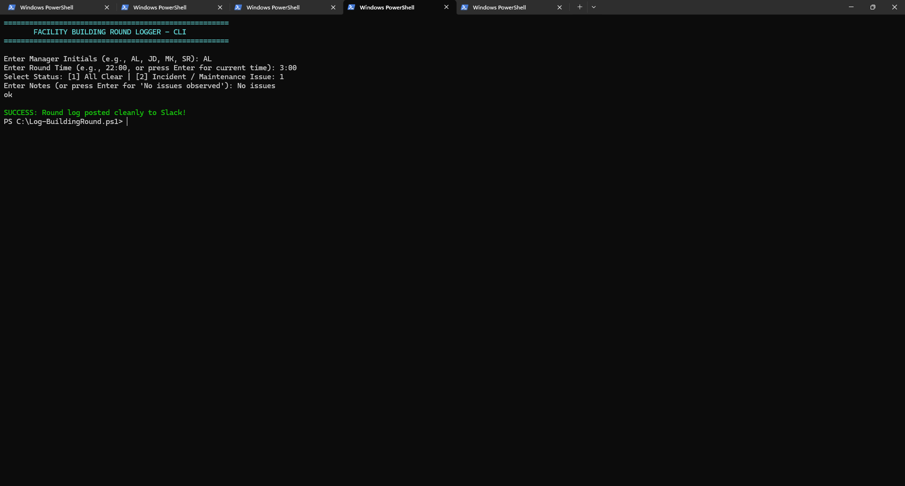
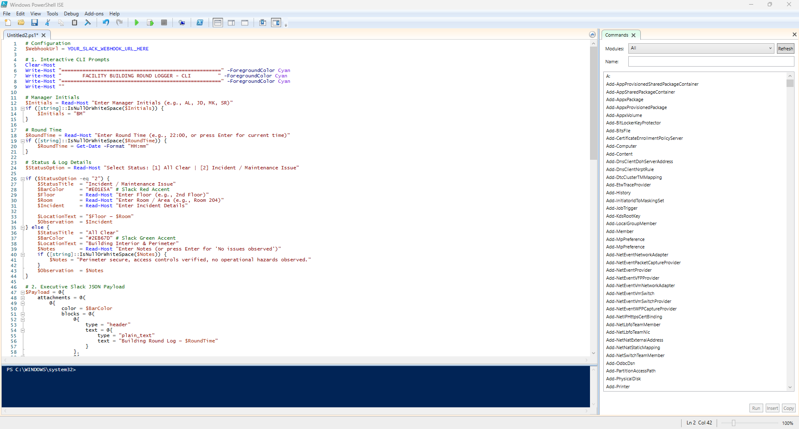
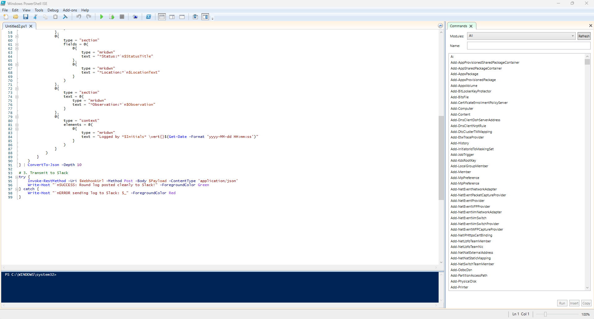

# PowerShell Slack Webhook Incident Logger

An interactive PowerShell CLI automation tool that standardizes facility round logging and incident reporting by posting formatted JSON alert cards to Slack via Webhooks.

## Overview
Built to replace manual, unstructured text updates during facility shifts with a clean command-line workflow. The script prompts team members for shift details, location, and issue severity, then builds and transmits custom Slack Block Kit payloads directly to an operations channel.

## Features
* **Interactive CLI Prompts:** Guides users through logging manager initials, round timestamps, floor/room locations, and shift observations.
* **Conditional Slack Formatting:** Uses Slack Block Kit attachments with dynamic side-accent borders (Green for "All Clear" routine rounds, Red for "Incident / Maintenance" alerts).
* **API Integration:** Structures multi-level JSON payloads sent via `Invoke-RestMethod` HTTP POST requests to Slack Incoming Webhook endpoints.
* **Built-in Error Handling:** Employs `try/catch` blocks to capture and report network or API transmission failures directly in the terminal.

## Execution & Output

### Terminal Execution


### PowerShell ISE & Code View



### Slack Channel Output


## How to Run
1. Clone the repository and open PowerShell.
2. Run the script:
   ```powershell
   .\Log-BuildingRound.ps1
